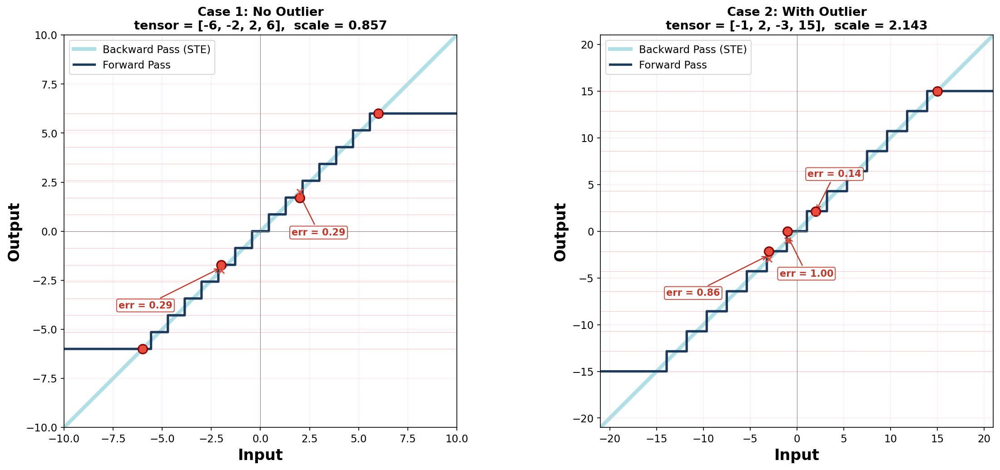

# Fake INT4 Quantization-Aware Training (QAT) Tutorial

## Overview

In Quantization-Aware Training (QAT), we simulate low-precision quantization during the forward pass while keeping full-precision weights for gradient updates. This **Fake Quantization** (quantize then immediately dequantize) lets the model "feel" quantization noise during training. The backward pass uses the **Straight-Through Estimator (STE)**: gradients pass through the non-differentiable rounding unchanged.

## Forward Pass: Group-wise Symmetric INT4 Fake Quantization

```
┌──────────────────────────────────────────────────────────────────────────────────────┐
│                     FAKE INT4 QUANTIZATION — FORWARD PASS                            │
│                                                                                      │
│  Input x: (2, 16)     group_size = 4     q_max = 7     block_size_m = 1              │
│                                                                                      │
│  ┌───────────┐   ┌────────────┐   ┌─────────────┐   ┌────────────┐   ┌───────────┐   │
│  │  1. Pad   │   │  2. Reshape│   │  3. Scale   │   │ 4. Quantize│   │5. Dequant │   │
│  │  m,n to   │ → │  into group│ → │  per group  │ → │  ÷ scale   │ → │  × scale  │   │
│  │  multiples│   │  (2,1,4,4) │   │  s=amax/7   │   │  round     │   │  restore  │   │
│  │  of blk_sz│   │            │   │  clamp≥1e-5 │   │  clamp±7   │   │  to float │   │
│  └───────────┘   └────────────┘   └─────────────┘   └────────────┘   └───────────┘   │
│        │                │                │                 │                │        │
│        ▼                ▼                ▼                 ▼                ▼        │
│   (2,16)→(2,16)   (2,16)→(2,1,4,4)  (2,1,4,1)       (2,1,4,4)       (2,1,4,4)        │
│   no pad needed   4 groups/row       1 scale/group   int in [-7,7]   back to float   │
│                                                                                      │
│  Finally: reshape back to (2, 16) and slice off any padding.                         │
│                                                                                      │
│  ═══════════════════════════════════════════════════════════════════════════════════ │
│                                                                                      │
│  Example: Group [0][0] = [ 1.93,  1.49,  0.90, -2.11]                                │
│  scale = max(|group|) / 7 = 2.11 / 7 = 0.301                                         │
│                                                                                      │
│     ÷ scale       round       clamp[-7,7]     × scale                                │
│    ┌───────┐    ┌───────┐    ┌───────┐    ┌──────────────────────────────────┐       │
│    │  6.41 │ →  │   6   │ →  │   6   │ →  │  1.80  (orig  1.93, err 0.12)    │       │
│    │  4.94 │ →  │   5   │ →  │   5   │ →  │  1.50  (orig  1.49, err 0.02)    │       │
│    │  2.99 │ →  │   3   │ →  │   3   │ →  │  0.90  (orig  0.90, err 0.00)    │       │
│    │ -7.00 │ →  │  -7   │ →  │  -7   │ →  │ -2.11  (orig -2.11, err 0.00)    │       │
│    └───────┘    └───────┘    └───────┘    └──────────────────────────────────┘       │
│                                                                                      │
│  The element with the largest |value| maps exactly; others incur quantization error. │
│  Backward: STE passes gradients through unchanged (identity).                        │
│                                                                                      │
└──────────────────────────────────────────────────────────────────────────────────────┘
```

## Illustration of Quantization

The figure below compares fake INT4 quantization on two (1, 4) tensors. The dark staircase is the forward pass (quantize-dequantize); the diagonal line is the backward pass (STE identity). Red dots mark tensor elements; dashed lines show quantization error.



**Case 1 — No Outlier** (`[-6, -2, 2, 6]`, scale = 0.857):
Narrow staircase steps (~0.86 wide), max error only 0.29. All 15 quantization levels used efficiently.

**Case 2 — With Outlier** (`[-1, 2, -3, 15]`, scale = 2.143):
The outlier forces a 2.5x wider scale. The value -1 is rounded to **0** (err = 1.00), -3 maps to -2.14 (err = 0.86), while the outlier itself is exact. Most quantization levels are wasted on the empty range.

## Files

| File | Description |
|------|-------------|
| `scaffold.py` | Skeleton code with TODOs for you to implement |
| `gt_implementation.py` | Ground truth reference implementation |
| `test_implementation.py` | Tests to verify your implementation against the GT |

## Usage

```bash
python test_implementation.py --scale   # test compute_scales only (implement this first)
python test_implementation.py --all     # test scales + forward + backward (default)
```
